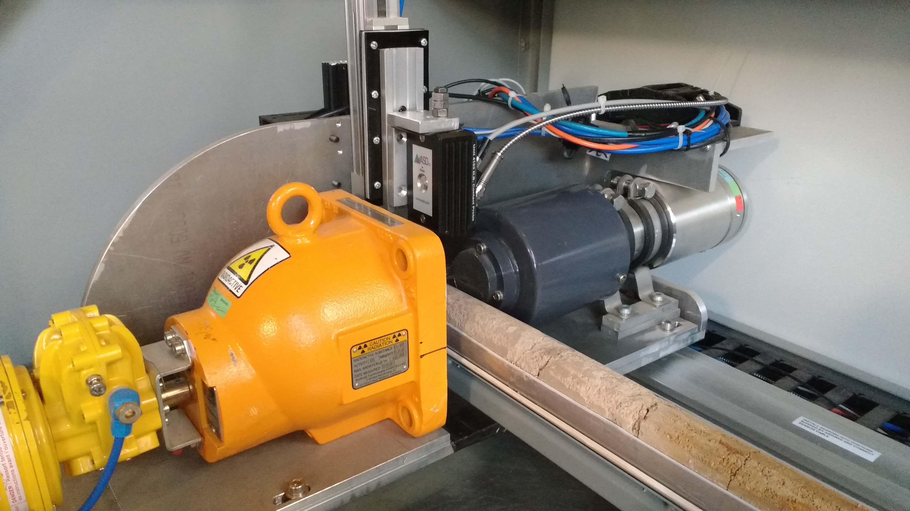

```{r setup, include=FALSE}
knitr::opts_chunk$set(
  results = 'asis',
  echo = FALSE,
  warning = FALSE,
  message = FALSE,
  fig.align = 'center'
)

#Load libraries
library(tidyverse)
library(gapminder)
library(gganimate)
library(kableExtra)
```


# Introduction
Data School can teach an old dog new tricks.
If I am not away on fieldtrips you can find me processing soil samples in the Butler Laboratory on Black Mountain, ACT.
Before Data School I had heard the terms; R, Python, Bowen, Pearcey, ggplot, Data Access Portal & machine learning. I was unable to learn them as was I too busy working to deliver project milestones on time, and balancing work & family life. 

# My Synthesis Project
Goal: Pipeline for processing core sensing platform (CSP) data in a reproducible automated way.

This involved generating data by scanning 22 cores from Macquarie Bogan Field-study, retrieving the data from the CSP Linux computer and storing data on Bowen. After which I needed to create a tidy data frame collecting data from directory names, csv file containing gamma & spectra data, other files with gamma calibration & GPS data.

The NIR spectra & Gamma counts needed processing before storing in a tidy data format. The NIR spectra needed pre-processing steps to filter raw spectra and use existing soil-water library to estimate soil water content and correct spectra for soil moisture attenuation. Brendan Malone was a big help in guiding me through the spectra processing.

Finally producing an R-Markdown report with tables & graphs for each individual core.

# My Digital Toolbox

All the skills used in this project were learnt from attending Data School.

The Research Data Management Plan was important at the start to confirm what data I could use & how.

FileZilla & Putty were important to retrieve data from CSP Linux computer.

R was used to process NIR spectra & Gamma data.

ggplot was used to visualise the core data.

R-Markdown to produce report for each core.

## Favourite tool 
I have really enjoyed using R and surprised myself what I can achieve with it.
Back in the lab I can see other uses for R in automating lab data analysis & visualisation.

ggplot is cool for data visualisation, but I am still learning new tricks to use it effectively.

# My time went ...

The code to pull out the data for the initial data-frame took a lot of time, trying to get the right information from each directory title & csv file. Also, the loop in the R code to correctly collect the data for the 22 cores from the 42 directories took a while to perfect.

All the pre-processing of the spectra data and the use of gamma data took a while to understand & implement.

When something didn't work in the R coding my solution was to break it into little steps and make sure each step worked before moving onto next step. I had to do this when creating loops which worked. Also, Google is your friend in solving error messages. 

The best time to be creative and productive in solving any problems varied for me; morning, afternoon, a whole day. A few times I would put it aside and come back later and solved it quickly.

# Next steps

The Markdown report for each core could be improved by adding the images captured by CSP camera. 

Also capturing more soil attributes from the spectra would be useful, such as; carbon, pH, & clay content. But this may be dependent on access to visNIR library for each attribute.

Need to investigate if there are other ways to improve bulk density measurements with data from CSP.

Investigate the package "inspectr" and any other packages that may be useful in processing and analysing spectra data.

I didn't use python in my Data school project, but I don't want to lose this skill, I will have to make time use it. Also, machine learning is something I wish to continue investigating for larger datasets.

<br/>
<br/>
<br/>


```{r, echo=FALSE, fig.cap="Core Sensing Platform", out.width = '80%' }

#{width=180px}
```

<br/>
<br/>
<br/>


```{r standard-plot, out.width='100%',fig.cap="Example CSP data", fig.align='center', fig.height= 3, fig.width=8}
#for T078_P1
TC <- "T078_P1"
#setwd("C:/Users/mcl226/DATASCHOOL/Synthesis_Project/poster/poster_templates")
VWC_gamma_dat_T078_P1 <- read.csv("VWC_gamma_dat_T078_P1.csv")
#VWC_gamma_dat_T078_P1
ggplot(VWC_gamma_dat_T078_P1, aes(x=core_depth_cm)) +
  geom_line(aes(y=predVWC,colour="predVWC")) + 
  geom_line(aes(y =bulk_density, colour="bulk_density"))+
  scale_colour_manual("",values=c("predVWC"="green","bulk_density"="blue"))+
  ggtitle(TC) + xlab("core depth (cm)") + ylab("VWC & Bulk Density(g/cm3)") +
  coord_cartesian(xlim =c(0, 200), ylim = c(0, 2.5))
```


# My Data School Experience
Tony, Seija, & I have already given a brief talk about Data Access Portal & Research Data Management Plan to Butler Lab to encourage awareness & discussion. We have also been asked to talk to our group about our Data School experience & project at sometime in the future.

I was nervous about Data School and whether I would be able to handle it, but lessons were adjusted, everyone in the cohort was able to learn. The teachers/tutors/mentors were very knowledgeable, helpful & wonderful. Data School was able to teach this old dog new tricks.

I was encouraged by my group leader, Ben Macdonald, to apply for Data School. It has been a privilege to spend the time in Data School and learn these new skills. I can see other ways of automating the analysis & visualisation of data from soil physics measurements we make in the laboratory.